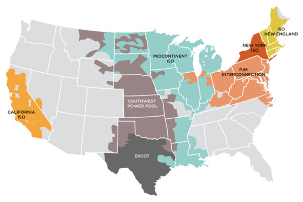

```{r setup directory and packages, include=FALSE}
library(tidyverse)
library(here)
library(dplyr)
#install.packages("readxl")
library(readxl)
library(lubridate)
library(trend)
library(stats)
library(corrplot)

getwd()
```

```{r setup theme, include=FALSE}
# Set your ggplot theme
mytheme <- theme_gray()+
  theme(plot.title = element_text(size = 16, hjust= 0),
        axis.title = element_text(size = 14),
        legend.position = 'right')

theme_set(mytheme)
```

```{r ERCOT, include=FALSE}
# Read the CSV files
x2010<- read_excel("Data/Raw/ERCOT_Source_Data/2010_ercot_hourly_load_data.xls") %>% 
  rename(Hour_Ending = Hour_End) %>%
  mutate(Hour_Ending = as.Date(Hour_Ending, format = "%m/%d/%Y"))
x2011<- read_excel("Data/Raw/ERCOT_Source_Data/2011_ercot_hourly_load_data.xls") %>% 
  rename(Hour_Ending = Hour_End) %>%
  mutate(Hour_Ending = as.Date(Hour_Ending, format = "%m/%d/%Y"))
x2012<- read_excel("Data/Raw/ERCOT_Source_Data/2012_ercot_hourly_load_data.xls") %>% 
  rename(Hour_Ending = Hour_End) %>%
  mutate(Hour_Ending = as.Date(Hour_Ending, format = "%m/%d/%Y"))
x2013<- read_excel("Data/Raw/ERCOT_Source_Data/2013_ercot_hourly_load_data.xls") %>% 
  rename(Hour_Ending = Hour_End) %>%
  mutate(Hour_Ending = as.Date(Hour_Ending, format = "%m/%d/%Y"))
x2014<- read_excel("Data/Raw/ERCOT_Source_Data/2014_ercot_hourly_load_data.xls") %>% 
  rename(Hour_Ending = Hour_End) %>%
  mutate(Hour_Ending = as.Date(Hour_Ending, format = "%m/%d/%Y"))
x2015<- read_excel("Data/Raw/ERCOT_Source_Data/native_load_2015.xls") %>% 
  rename(Hour_Ending = Hour_End) %>%
  mutate(Hour_Ending = as.Date(Hour_Ending, format = "%m/%d/%Y"))
x2016<- read_excel("Data/Raw/ERCOT_Source_Data/native_Load_2016.xlsx") %>% 
  rename(Hour_Ending = Hour_End) %>%
  mutate(Hour_Ending = as.Date(Hour_Ending, format = "%m/%d/%Y"))
x2017<- read_excel("Data/Raw/ERCOT_Source_Data/native_Load_2017.xlsx") %>% 
  rename(Hour_Ending = "Hour Ending") %>%
  mutate(Hour_Ending = as.Date(Hour_Ending, format = "%m/%d/%Y"))
x2018<- read_excel("Data/Raw/ERCOT_Source_Data/Native_Load_2018.xlsx") %>% 
  rename(Hour_Ending = "HourEnding") %>%
  mutate(Hour_Ending = as.Date(Hour_Ending, format = "%m/%d/%Y"))
x2019<- read_excel("Data/Raw/ERCOT_Source_Data/Native_Load_2019.xlsx") %>% 
  rename(Hour_Ending = "HourEnding") %>%
  mutate(Hour_Ending = as.Date(Hour_Ending, format = "%m/%d/%Y"))
x2020<- read_excel("Data/Raw/ERCOT_Source_Data/Native_Load_2020.xlsx") %>% 
  rename(Hour_Ending = "HourEnding") %>%
  mutate(Hour_Ending = as.Date(Hour_Ending, format = "%m/%d/%Y"))
x2021<- read_excel("Data/Raw/ERCOT_Source_Data/Native_Load_2021.xlsx") %>% 
  rename(Hour_Ending = "Hour Ending") %>%
  mutate(Hour_Ending = as.Date(Hour_Ending, format = "%m/%d/%Y"))
x2022<- read_excel("Data/Raw/ERCOT_Source_Data/Native_Load_2022.xlsx") %>% 
  rename(Hour_Ending = "Hour Ending") %>%
  mutate(Hour_Ending = as.Date(Hour_Ending, format = "%m/%d/%Y"))

# Merge the data frames based on a common column
ercot <- bind_rows(x2010, x2011, x2012, x2013, x2014, x2015, x2016, x2017, x2018, x2019, x2020, x2021, x2022)

ercot_load <- ercot %>%
  select(Hour_Ending,ERCOT)
```

```{r load data PJM, include=FALSE}
# Read the CSV files
PJM_2010<- read_csv("Data/Raw/PJM_Source_Data/PJM_MeteredHourlyLoad_2010.csv") %>% 
  rename(Date = datetime_beginning_ept, Load_MW = mw) %>%
  mutate(Date = as.Date(Date, format = "%m/%d/%Y"))
PJM_2010 <- PJM_2010[, c(2, 7)]

PJM_2011<- read_csv("Data/Raw/PJM_Source_Data/PJM_MeteredHourlyLoad_2011.csv") %>% 
  rename(Date = datetime_beginning_ept, Load_MW = mw) %>%
  mutate(Date = as.Date(Date, format = "%m/%d/%Y"))
PJM_2011 <- PJM_2011[, c(2, 7)]

PJM_2012<- read_csv("Data/Raw/PJM_Source_Data/PJM_MeteredHourlyLoad_2012.csv") %>% 
  rename(Date = datetime_beginning_ept, Load_MW = mw) %>%
  mutate(Date = as.Date(Date, format = "%m/%d/%Y"))
PJM_2012 <- PJM_2012[, c(2, 7)]

PJM_2013<- read_csv("Data/Raw/PJM_Source_Data/PJM_MeteredHourlyLoad_2013.csv") %>% 
  rename(Date = datetime_beginning_ept, Load_MW = mw) %>%
  mutate(Date = as.Date(Date, format = "%m/%d/%Y"))
PJM_2013 <- PJM_2013[, c(2, 7)]

PJM_2014<- read_csv("Data/Raw/PJM_Source_Data/PJM_MeteredHourlyLoad_2014.csv") %>% 
  rename(Date = datetime_beginning_ept, Load_MW = mw) %>%
  mutate(Date = as.Date(Date, format = "%m/%d/%Y"))
PJM_2014 <- PJM_2014[, c(2, 7)]

PJM_2015<- read_csv("Data/Raw/PJM_Source_Data/PJM_MeteredHourlyLoad_2015.csv") %>% 
  rename(Date = datetime_beginning_ept, Load_MW = mw) %>%
  mutate(Date = as.Date(Date, format = "%m/%d/%Y"))
PJM_2015 <- PJM_2015[, c(2, 7)]

PJM_2016<- read_csv("Data/Raw/PJM_Source_Data/PJM_MeteredHourlyLoad_2016.csv") %>% 
  rename(Date = datetime_beginning_ept, Load_MW = mw) %>%
  mutate(Date = as.Date(Date, format = "%m/%d/%Y"))
PJM_2016 <- PJM_2016[, c(2, 7)]

PJM_2017<- read_csv("Data/Raw/PJM_Source_Data/PJM_MeteredHourlyLoad_2017.csv") %>% 
  rename(Date = datetime_beginning_ept, Load_MW = mw) %>%
  mutate(Date = as.Date(Date, format = "%m/%d/%Y"))
PJM_2017 <- PJM_2017[, c(2, 7)]

PJM_2018<- read_csv("Data/Raw/PJM_Source_Data/PJM_MeteredHourlyLoad_2018.csv") %>% 
  rename(Date = datetime_beginning_ept, Load_MW = mw) %>%
  mutate(Date = as.Date(Date, format = "%m/%d/%Y"))
PJM_2018 <- PJM_2018[, c(2, 7)]

PJM_2019<- read_csv("Data/Raw/PJM_Source_Data/PJM_MeteredHourlyLoad_2019.csv") %>% 
  rename(Date = datetime_beginning_ept, Load_MW = mw) %>%
  mutate(Date = as.Date(Date, format = "%m/%d/%Y"))
PJM_2019 <- PJM_2019[, c(2, 7)]

PJM_2020<- read_csv("Data/Raw/PJM_Source_Data/PJM_MeteredHourlyLoad_2020.csv") %>% 
  rename(Date = datetime_beginning_ept, Load_MW = mw) %>%
  mutate(Date = as.Date(Date, format = "%m/%d/%Y"))
PJM_2020 <- PJM_2020[, c(2, 7)]

PJM_2021<- read_csv("Data/Raw/PJM_Source_Data/PJM_MeteredHourlyLoad_2021.csv") %>% 
  rename(Date = datetime_beginning_ept, Load_MW = mw) %>%
  mutate(Date = as.Date(Date, format = "%m/%d/%Y"))
PJM_2021 <- PJM_2021[, c(2, 7)]

PJM_2022<- read_csv("Data/Raw/PJM_Source_Data/PJM_MeteredHourlyLoad_2022.csv") %>% 
  rename(Date = datetime_beginning_ept, Load_MW = mw) %>%
  mutate(Date = as.Date(Date, format = "%m/%d/%Y"))
PJM_2022 <- PJM_2022[, c(2, 7)]

#Merge the data frames based on a common column
PJM_load <- bind_rows(PJM_2010, PJM_2011, PJM_2012, PJM_2013, PJM_2014, PJM_2015, PJM_2016, PJM_2017, PJM_2018, PJM_2019, PJM_2020, PJM_2021, PJM_2022)
```

# Github Repository

<https://github.com/jazpritch/KarneiKogaWargoPritchett_ENV872_EDA_FinalProject>

\newpage

# 1. Rationale and Research Questions

```{r, echo=FALSE, out.height= "300px"}


```

The U.S. electric grid is a complex web of deregulated and regulated energy markets operating to provide reliable and affordable electricity to its customers. There are seven deregulated markets in the country, known as Independent System Operators (ISOs) or Regional Transmission Organizations (RTOs). Two grid operators -- PJM Interconnection and Electric Reliability Council of Texas (ERCOT) -- were selected for this analysis to compare and contrast their electricity load patterns and drivers. The reason for choosing PJM and ERCOT was due to their size, geographic reach, and market dynamism. Combined, ERCOT and PJM provide electricity to 90 million customers -- almost a third of the U.S. population. PJM is a grid operator that serves 13 states in the Northeast and the District of Columbia, whereas ERCOT predominantly operates in one state -- Texas. Both markets saw significant changes in their energy fuel mix and customer size over the past several decades. The structural differences between PJM and ERCOT, together with their large customer base, present an interesting case for comparison.

The current analysis aims to answer the following questions:

1.  **Has load in ERCOT and PJM increased over time? If so, has it grown at the same rate across the two energy markets?**

2.  **What are the key social, economic, and energy-related drivers of electricity demand growth in ERCOT and PJM? Are there any differences between the markets?**

This paper will explore how factors such as population size, employment rate, median income, residential electricity bill, and renewable penetration affect load growth. As the U.S. moves toward a net-zero economy, a large share of the transportation, residential, and industrial sectors will be electrified, thus increasing total electricity demand. To better plan for the future needs of the U.S. electric grid, it is critical to examine the historical trends in electricity load and key aspects affecting it. This analysis aims to shed light on the interplay between electricity consumption and socioeconomic characteristics of the ERCOT and PJM customer base to add to the growing body of literature discussing the past, present, and future of electricity demand in the U.S.

\newpage

# 2. Dataset Information and Wrangling

To answer our first research question which examines if the load in ERCOT and PJM has increased over time, we collected historical hourly load data for 2010-2022 from the ERCOT and PJM websites respectively. The hourly load data for each market has been grouped by day and month for the time series analysis purpose.

## 2.1 PJM Load Data

The PJM website provides metered hourly data which contain the net energy in megawatt-hours consumed by the service territories within the PJM RTO. The data is sourced from the electric distribution companies within PJM, reflecting the highest quality of metered load within their respective zones. The dataset includes values submitted by companies or estimated values generated by PJM in cases where company data is unavailable. For the analysis, metered hourly load data with 8760 observations for each year from 2010 to 2022 were downloaded and merged into one data frame. Additionally, the hourly data has been converted into daily and monthly datasets by taking the mean of every 24-hour and each month respectively for the time series analysis.

\centering Table 1: Dataset Information for PJM \centering

| **Detail**      | **Description**                                               |
|:------------------|-----------------------------------------------------|
| Data Source:    | JM Website - Metered Hourly Load                              |
| Retrieved From: | <https://dataminer2.pjm.com/feed/hrl_load_metered/definition> |
| Variables Used: | datetime_beginning_ept(Date), mw (Load_MW)                    |
| Date Range:     | 1/1/2010 - 12/31/2022                                         |

\raggedright

## 2.2 PJM Price Data

The PJM website provides day-ahead scheduling reserve data and regulation zone preliminary billing data which contain locational marginal prices (LMPs) per megawatt-hour consumed. Regulation zone preliminary billing data is sourced from the electric distribution companies within PJM, reflecting the highest quality of metered load within their respective zones and associated prices. The dataset includes values submitted by companies or estimated values generated by PJM in cases where company data is not available. For day-ahead values, prices and market activities are delivered one day ahead of the actual delivery of electricity. LMPs are calculated for the next day based on the amount of energy to be generated, the amount of energy needed by consumers, and scheduled transactions between consumers and distribution companies. For the analysis, metered hourly load data with 8760 observations for each year from 2013 to 2022 for real-time and 2010-2022 for day-ahead were downloaded and merged into one data frame.

\centering Table 2: Real-Time Dataset Information for PJM \centering

| **Detail**      | **Description**                                                   |
|:------------------|-----------------------------------------------------|
| Data Source:    | PJM website - Regulation Zone Preliminary Billing Data            |
| Retrieved From: | <https://dataminer2.pjm.com/feed/reg_zone_prelim_bill/definition> |
| Variables Used: | datetime_beginning_ept(Date), mw (Load_MW), rmpcp (Price)         |
| Date Range:     | 1/1/2013 - 12/31/2022                                             |

\newpage

\centering Table 3: Day-Ahead Dataset Information for PJM \centering

| **Detail**      | **Description**                                              |
|:------------------|-----------------------------------------------------|
| Data Source:    | PJM website - Day-Ahead Scheduling Reserve                   |
| Retrieved From: | <https://dataminer2.pjm.com/feed/dasr_results/definition>    |
| Variables Used: | datetime_beginning_ept (Date), mw (Load_MW), dasrmcp (Price) |
| Date Range:     | 1/1/2010 - 12/31/2022                                        |

\raggedright

## 2.3 ERCOT Load Data

The ERCOT website provides historical hourly data which contains the net energy in megawatt-hours consumed by the ERCOT control area. The dataset takes values from different zones and areas and compiles them into a total ERCOT value for each hour. For the analysis, metered hourly load data with over 8000 observations for each year from 2010 to 2022 were downloaded and merged into one data frame. Additionally, the hourly data has been converted into daily and monthly datasets by taking the mean of every 24-hour and each month respectively for the time series analysis.

\centering Table 4: Dataset Information for ERCOT \centering

| **Detail**      | **Description**                                 |
|:----------------|-------------------------------------------------|
| Data Source:    | ERCOT Hourly Load Data Archives                 |
| Retrieved From: | <https://www.ercot.com/gridinfo/load/load_hist> |
| Variables Used: | Hour_Ending, ERCOT                              |
| Date Range:     | 1/1/2010 - 12/31/2022                           |

\raggedright

## 2.4 ERCOT Demographic Data

To analyze what factors contribute to load in ERCOT over time, we compiled various demographic variables as well as other important energy system variables: average energy bill price (cents/kWh), percentage renewable generation, total population, percent minority population, and median income. For our analysis, we assume that Texas and ERCOT are similar enough to be equated. This is important to note because ERCOT does not technically encompass the entire state. Still, many variables considered here have much more robust and easily accessible data for Texas than the ERCOT service area.

The Energy Information Administration (EIA) provided the average Texas energy bill prices for each year in our scope, broken down by consumption sector (residential, commercial, industrial, and transportation) and averaged across each. Because the total average is a function of the average prices for each sector, we chose to exclude the breakdowns and just use the total average to avoid multicollinearity. The percentage of renewable generation in Texas for the years 2010-2022 was calculated using the Net Generation 1990-2022 report provided by the EIA. The calculation took the sum of solar, wind, and hydroelectric generation divided by the total generation to get the portion of renewable generation for each year of interest. Population and percent minority were provided through the United States Census Bureau Historical population data taken for the years 2010-2022. Percent minority was calculated by taking "white only" percentages from the census survey and subtracting them from the total population. Median household income was taken from the Federal Reserve Economic Data (FRED) platform and is stated as being estimates based on linear interpolation that follows the Census Bureau's methodology. \newpage \centering Table 5: ERCOT Linear Model Demographic Data \centering

| **Detail**         | **Description**                                                                                                                             |
|:-----------------|------------------------------------------------------|
| Year:              | 2010 - 2022                                                                                                                                 |
| Electricity Price: | Average prices of electricity to ultimate customers (<https://www.eia.gov/totalenergy/data/monthly/pdf/sec9_11.pdf>)                        |
| Median Income:     | Income level at which half of the households in Texas earn more and half earn less (<https://fred.stlouisfed.org/series/MEHOINUSTXA672N#> ) |
| Percent Renewable: | Net Generation by State by Type of Producer by Energy Source(<https://www.eia.gov/electricity/data/state/annual_generation_state.xls>)      |
| Percent Minority:  | Subtraction of white only percentages after dividing white popultion from totals (U.S. Census 2010-2022)                                    |
| Population:        | Total Population each year for Texas (<https://www.census.gov/programs-surveys/popest/data/data-sets.html>)                                 |
| Mean Load:         | Average load for ERCOT                                                                                                                      |

\raggedright

# 3. Exploratory Analysis of Data

Figure 1 illustrates the distribution of electricity load between ERCOT and PJM for the years 2010-2022. The vertically flat box plot of ERCOT indicates low variability in the data, reflecting its role as an independent operator in Texas. In contrast, the wider spread of data in the PJM boxplot is consistent with its regional coverage over multiple states. The box plots provide a visual summary of load distribution, highlighting the differences in variability between the two operators, which can be attributed to their operational coverage and help determine load growth.

```{r Load Distribution Boxplot, echo = FALSE, warning = FALSE, message = FALSE}
boxplot(ercot_load, PJM_load, names = c("ERCOT", "PJM"), ylab = "Load (MW)", 
        main = "Electricity Load Distribution in ERCOT vs PJM 2010-2022", 
        par(font.main = 1))

mtext("Figure 1", line=0.5)
```

Figure 2 and Figure 3 show the monthly electricity load from 2010 to 2022 with a trend line over time in PJM and ERCOT, respectively. The trend lines in both figures seem to be increasing over time, which have been statistically tested below.

```{r Monthly Load Plot ERCOT, echo = FALSE, warning = FALSE, message = FALSE,fig.height=3.75}
#Aggregrate by month 
ercot_load_monthly <- ercot_load %>%
  mutate(
    Year = year(Hour_Ending),
    Month = month(Hour_Ending)
  ) %>%
  group_by(Year, Month) %>%
  summarise(
    Mean_Load = mean(ERCOT, na.rm = TRUE)
  )

ercot_load_monthly$NewDate <- 
  as.Date(paste(ercot_load_monthly$Year, ercot_load_monthly$Month, "01", sep = "-")) 

#Plot
graph1 <- ggplot(ercot_load_monthly, aes(x = NewDate, y = Mean_Load)) +
  geom_line(color = "blue") +
  geom_smooth(method = "lm") +
  ggtitle('Monthly Electricity Load in ERCOT from 2010 to 2022') + 
  labs(x = "Year", y = "Average Monhtly Load (MW)", subtitle = "Figure 2")

graph1
```

```{r Monthly Load Plot PJM, echo = FALSE, warning = FALSE, message = FALSE, fig.height=3.75}
#Aggregate by month
PJM_load_monthly <- PJM_load %>%
  mutate(
    Year = year(Date),
    Month = month(Date)
  ) %>%
  group_by(Year, Month) %>%
  summarise(
    Mean_Load = mean(Load_MW, na.rm = TRUE)
  )

PJM_load_monthly$NewDate <- 
  as.Date(paste(PJM_load_monthly$Year, PJM_load_monthly$Month, "01", sep = "-"))

#Plot 
PJMgraph_month<- ggplot(PJM_load_monthly, aes(x = NewDate, y = Mean_Load)) +
  geom_line(color = "black") +
  geom_smooth(method = "lm") +
  ggtitle('Monthly Electricity Load in PJM from 2010 to 2022') + 
  labs(x = "Year", y = "Average Monhtly Load (MW)", subtitle = "Figure 3")

PJMgraph_month
```

# 4. Analysis

## 4.1 Time Series Analysis

Time series objects were created for the average monthly load data for PJM and ERCOT and were subsequently decomposed into seasonal, trend, and remainder components (Figure 4, Figure 5). The seasonal Mann-Kendall test was applied to test the null hypothesis that the increasing trend in the PJM and ERCOT monthly load data is not statistically significant. The test results indicate that there is a statistically significant increasing trend in the PJM electricity load from 2010 to 2022 with its positive score of 82902071 and tau of 0.068. A p-value smaller than 0.05 allowed us to reject the null hypothesis. Similarly, the results of the seasonal Mann-Kendall test for the ERCOT data showed a statistically significant increase in load over time (tau=0.341, score=361963, p\<0.05). Therefore, we were able to conclude that average monthly electricity demand has grown over time in both energy markets.

In the next step, we extracted the seasonal components from the time series objects to determine the load changes over time without seasonality impacts. The Mann-Kendall test on the non-seasonal data allowed us to reject the null hypothesis for the PJM and ERCOT data (p-value \<0.05), which pointed to a statistically significant increasing trend. Hence, we were able to confidently conclude that PJM load and ERCOT load have changed from 2010 to 2022 without seasonality components.

**The null hypothesis: Electricity load in ERCOT remained the same from 2010 to 2022.** **Alternative hypothesis: Electricity load in ERCOT has changed from 2010 to 2022.**

```{r ERCOT Monthly Decomposed Plot, echo = FALSE, warning = FALSE, message = FALSE}
#Aggregate data by day 
ercot_load_daily<- ercot_load %>%
  mutate(
    Year = year(Hour_Ending),
    Month = month(Hour_Ending),
    Day = day (Hour_Ending)
  ) %>%
  group_by(Year, Month, Day) %>%
  summarise(
    Mean_Load = mean(ERCOT, na.rm = TRUE)
  )

ercot_load_daily$NewDate <- 
  as.Date(paste(ercot_load_daily$Year, ercot_load_daily$Month,ercot_load_daily$Day, sep = "-"))

#Aggregate data by year
ercot_load_yearly <- ercot_load %>%
  mutate(
    year = year(Hour_Ending)
  ) %>%
  group_by(year) %>%
  summarise(
    Mean_Load = mean(ERCOT, na.rm = TRUE)
  ) %>% 
  drop_na()

#Dataframe
ercot_load_monthly_ts <- ts(
  ercot_load_daily$Mean_Load,
  start = c(2010,1),
  frequency = 12)

#Plot
monthly_decomposed <- stl(ercot_load_monthly_ts, s.window="periodic")
plot(monthly_decomposed, main = "Figure 4")

```

```{r ERCOT TEST,  echo = FALSE, warning = FALSE, message = FALSE, include = FALSE}
monthly_load_trend <- Kendall::SeasonalMannKendall(ercot_load_monthly_ts)
summary(monthly_load_trend)
```

```{r ERCOT DESEASON TEST,  echo = FALSE, warning = FALSE, message = FALSE, include = FALSE}
# Extract seasonal component from the time series 

monthly_decomposed_components <- as.data.frame(monthly_decomposed$time.series[,1:3])

monthly_decomposed_deseasoned <- 
  ercot_load_monthly_ts-monthly_decomposed_components$seasonal

# Run the Mann Kendall test on the non-seasonal data
monthly_load_trend_deseason <- Kendall::MannKendall(monthly_decomposed_deseasoned)
summary(monthly_load_trend_deseason)
```

**The null hypothesis: Electricity load in PJM remained the same from 2010 to 2022.** **Alternative hypothesis: Electricity load in PJM has changed from 2010 to 2022.**

```{r PJM Monthly Decomposed Plot, echo = FALSE, warning = FALSE, message = FALSE}
#Aggregate data by day 
PJM_load_daily<- PJM_load %>%
  mutate(
    Year = year(Date),
    Month = month(Date),
    Day = day(Date)
  ) %>%
  group_by(Year, Month, Day) %>%
  summarise(
    Mean_Load = mean(Load_MW, na.rm = TRUE)
  )

PJM_load_daily$NewDate <- 
  as.Date(paste(PJM_load_daily$Year, PJM_load_daily$Month,PJM_load_daily$Day, sep = "-"))

#Dataframe
PJM_load_monthly_ts <- ts(
  PJM_load_daily$Mean_Load,
  start = c(2010,1),
  frequency = 12
)

#Plot
monthly_decomposed_PJM <- stl(PJM_load_monthly_ts, s.window="periodic")
plot(monthly_decomposed_PJM, main = "Figure 5")

```

```{r PJM TEST,  echo = FALSE, warning = FALSE, message = FALSE,include = FALSE}
monthly_load_trend_PJM <- Kendall::SeasonalMannKendall(PJM_load_monthly_ts)
summary(monthly_load_trend_PJM)
```

```{r PJM DESEASON TEST,  echo = FALSE, warning = FALSE, message = FALSE, include = FALSE}
# Extract seasonal component from the time series 

monthly_decomposed_components_PJM <- as.data.frame(monthly_decomposed_PJM$time.series[,1:3])

monthly_decomposed_deseasoned_PJM <- 
  PJM_load_monthly_ts-monthly_decomposed_components_PJM$seasonal

# Run the Mann Kendall test on the non-seasonal data

monthly_load_trend_deseason_PJM <- Kendall::MannKendall(monthly_decomposed_deseasoned_PJM)
summary(monthly_load_trend_deseason_PJM)
```

## 4.2 Growth Analysis

We calculated the annual load growth rate from 2010 to 2022 for ERCOT and PJM to understand if the electricity load has grown at the same rate across the two markets.

```{r Annual Growth ERCOT, echo = FALSE, warning = FALSE, message = FALSE, include = FALSE}
# Aggregate data by year
ercot_load_annual <- ercot_load %>%
  mutate(
    Year = year(Hour_Ending)) %>%
  group_by(Year) %>%
  summarise(
    Mean_Load = mean(ERCOT, na.rm = TRUE)
  )

ercot_load_annual

# Remove year 2023 as it is incomplete
ercot_load_annual <- subset(ercot_load_annual, Year != "N/A")
ercot_load_annual

# Calculate annual rate of growth 

ercot_load_annual <- ercot_load_annual %>%
  mutate(Growth_Rate_Percent= (Mean_Load / lag(Mean_Load) - 1) * 100)

ercot_load_annual

# Calculate total average annual load growth 
total_mean_growth <- mean(ercot_load_annual$Growth_Rate_Percent, na.rm = TRUE)
total_mean_growth  
```

```{r Annual Growth PJM, echo = FALSE, warning = FALSE, message = FALSE, include = FALSE}
# Aggregate data by year
pjm_load_annual <- PJM_load %>%
  mutate(
    Year = year(Date)) %>%
  group_by(Year) %>%
  summarise(
    Mean_Load = mean(Load_MW, na.rm = TRUE)
  )

pjm_load_annual

pjm_load_annual <- pjm_load_annual %>%
  mutate(Growth_Rate_Percent= (Mean_Load / lag(Mean_Load) - 1) * 100)

pjm_load_annual

# Calculate total average annual load growth 
total_mean_growth <- mean(pjm_load_annual$Growth_Rate_Percent, na.rm = TRUE)
total_mean_growth 
```

While ERCOT load shows relatively constant growth each year, the PJM load growth rate displays fluctuation. One thing in common is that both markets experienced a decrease in the load in 2020; the load in ERCOT and PJM have dropped by 0.81% and 4.06% respectively in 2020. This can be explained by the COVID-19 pandemic which paused a lot of social and economic activities. What's interesting is the opposite direction of load change in 2012; whereas PJM load has increased by 5.33% which is the maximum growth rate for PJM between 2010 and 2022, ERCOT load has decreased by 2.96% in 2012 from the year before. ERCOT observes the maximum growth rate in 2022, increasing by 9.47% from 2021. Overall, the total average annual growth rate is 2.58% for ERCOT and 0.96% for PJM. Hence, ERCOT has experienced more growth in electricity load from 2010 to 2022 than PJM has. \newpage

## 4.3 Simple Linear Regression of PJM

**The null hypothesis: There is no effect of LMP on electricity load in PJM from 2010 and 2013 to 2022.** **Alternative hypothesis: LMP has an effect on electricity load in PJM from 2010 and 2013 to 2022.**

The analysis of load growth is influenced by various factors, including those related to demand, energy-efficient technology, and energy consumption across different sectors along with market dynamics and policy regulation. Linear regression was conducted to model the relationship between price and both real-time (Figure 5) and day-ahead load (Figure 6). The factor of price was selected due to it's accessibility given the cover area of PJM spanning over multiple states compared to the sole state coverage of Texas that ERCOT has. Based on the analysis of load in comparison to price, results show that growth is influenced by a diverse set of variables beyond price.

```{r Load in price data Real-time,  echo = FALSE, warning = FALSE, message = FALSE}

# Read the CSV files
rt_2013<- read_csv("Data/Raw/PJM_Source_Data/rt_2013.csv") %>% 
  rename(Date = datetime_beginning_ept, Price = rmpcp, Load_MW = total_pjm_rt_load_mwh) %>%
  mutate(Date = as.Date(Date, format = "%m/%d/%Y"))

rt_2014<- read_csv("Data/Raw/PJM_Source_Data/rt_2014.csv") %>% 
  rename(Date = datetime_beginning_ept, Price = rmpcp, Load_MW = total_pjm_rt_load_mwh) %>%
  mutate(Date = as.Date(Date, format = "%m/%d/%Y"))

rt_2015<- read_csv("Data/Raw/PJM_Source_Data/rt_2015.csv") %>% 
  rename(Date = datetime_beginning_ept, Price = rmpcp, Load_MW = total_pjm_rt_load_mwh) %>%
  mutate(Date = as.Date(Date, format = "%m/%d/%Y"))

rt_2016<- read_csv("Data/Raw/PJM_Source_Data/rt_2016.csv") %>% 
  rename(Date = datetime_beginning_ept, Price = rmpcp, Load_MW = total_pjm_rt_load_mwh) %>%
  mutate(Date = as.Date(Date, format = "%m/%d/%Y"))

rt_2017<- read_csv("Data/Raw/PJM_Source_Data/rt_2017.csv") %>% 
  rename(Date = datetime_beginning_ept, Price = rmpcp, Load_MW = total_pjm_rt_load_mwh) %>%
  mutate(Date = as.Date(Date, format = "%m/%d/%Y"))

rt_2018<- read_csv("Data/Raw/PJM_Source_Data/rt_2018.csv") %>% 
  rename(Date = datetime_beginning_ept, Price = rmpcp, Load_MW = total_pjm_rt_load_mwh) %>%
  mutate(Date = as.Date(Date, format = "%m/%d/%Y"))

rt_2019<- read_csv("Data/Raw/PJM_Source_Data/rt_2019.csv") %>% 
  rename(Date = datetime_beginning_ept, Price = rmpcp, Load_MW = total_pjm_rt_load_mwh) %>%
  mutate(Date = as.Date(Date, format = "%m/%d/%Y"))

rt_2020<- read_csv("Data/Raw/PJM_Source_Data/rt_2020.csv")%>% 
  rename(Date = datetime_beginning_ept, Price = rmpcp, Load_MW = total_pjm_rt_load_mwh) %>%
  mutate(Date = as.Date(Date, format = "%m/%d/%Y"))

rt_2021<- read_csv("Data/Raw/PJM_Source_Data/rt_2021.csv") %>% 
  rename(Date = datetime_beginning_ept, Price = rmpcp, Load_MW = total_pjm_rt_load_mwh) %>%
  mutate(Date = as.Date(Date, format = "%m/%d/%Y"))

rt_2022<- read_csv("Data/Raw/PJM_Source_Data/rt_2022.csv") %>% 
  rename(Date = datetime_beginning_ept, Price = rmpcp, Load_MW = total_pjm_rt_load_mwh) %>%
  mutate(Date = as.Date(Date, format = "%m/%d/%Y"))


#Merge the data frames based on a common column
rt_load <- bind_rows(rt_2013, rt_2014, rt_2015, rt_2016, rt_2017, rt_2018, rt_2019, rt_2020, rt_2021, PJM_2022)
```

```{r Load in price data Day-ahead,  echo = FALSE, warning = FALSE, message = FALSE}
# Read the CSV files
dasr_2010<- read_csv("Data/Raw/PJM_Source_Data/dasr_2010.csv") %>% 
  rename(Date = datetime_beginning_ept, Price = dasrmcp, Load_MW = total_pjm_rt_load_mwh) %>%
  mutate(Date = as.Date(Date, format = "%m/%d/%Y"))

dasr_2011<- read_csv("Data/Raw/PJM_Source_Data/dasr_2011.csv") %>% 
  rename(Date = datetime_beginning_ept, Price = dasrmcp, Load_MW = total_pjm_rt_load_mwh) %>%
  mutate(Date = as.Date(Date, format = "%m/%d/%Y"))

dasr_2012<- read_csv("Data/Raw/PJM_Source_Data/dasr_2012.csv") %>% 
  rename(Date = datetime_beginning_ept, Price = dasrmcp, Load_MW = total_pjm_rt_load_mwh) %>%
  mutate(Date = as.Date(Date, format = "%m/%d/%Y"))

dasr_2013<- read_csv("Data/Raw/PJM_Source_Data/dasr_2013.csv") %>% 
  rename(Date = datetime_beginning_ept, Price = dasrmcp, Load_MW = total_pjm_rt_load_mwh) %>%
  mutate(Date = as.Date(Date, format = "%m/%d/%Y"))

dasr_2014<- read_csv("Data/Raw/PJM_Source_Data/dasr_2014.csv") %>% 
  rename(Date = datetime_beginning_ept, Price = dasrmcp, Load_MW = total_pjm_rt_load_mwh) %>%
  mutate(Date = as.Date(Date, format = "%m/%d/%Y"))

dasr_2015<- read_csv("Data/Raw/PJM_Source_Data/dasr_2015.csv") %>% 
  rename(Date = datetime_beginning_ept, Price = dasrmcp, Load_MW = total_pjm_rt_load_mwh) %>%
  mutate(Date = as.Date(Date, format = "%m/%d/%Y"))

dasr_2016<- read_csv("Data/Raw/PJM_Source_Data/dasr_2016.csv") %>% 
  rename(Date = datetime_beginning_ept, Price = dasrmcp, Load_MW = total_pjm_rt_load_mwh) %>%
  mutate(Date = as.Date(Date, format = "%m/%d/%Y"))

dasr_2017<- read_csv("Data/Raw/PJM_Source_Data/dasr_2017.csv") %>% 
  rename(Date = datetime_beginning_ept, Price = dasrmcp, Load_MW = total_pjm_rt_load_mwh) %>%
  mutate(Date = as.Date(Date, format = "%m/%d/%Y"))

dasr_2018<- read_csv("Data/Raw/PJM_Source_Data/dasr_2018.csv") %>% 
  rename(Date = datetime_beginning_ept, Price = dasrmcp, Load_MW = total_pjm_rt_load_mwh) %>%
  mutate(Date = as.Date(Date, format = "%m/%d/%Y"))

dasr_2019<- read_csv("Data/Raw/PJM_Source_Data/dasr_2019.csv") %>% 
  rename(Date = datetime_beginning_ept, Price = dasrmcp, Load_MW = total_pjm_rt_load_mwh) %>%
  mutate(Date = as.Date(Date, format = "%m/%d/%Y"))

dasr_2020<- read_csv("Data/Raw/PJM_Source_Data/dasr_2020.csv")%>% 
  rename(Date = datetime_beginning_ept, Price = dasrmcp, Load_MW = total_pjm_rt_load_mwh) %>%
  mutate(Date = as.Date(Date, format = "%m/%d/%Y"))

dasr_2021<- read_csv("Data/Raw/PJM_Source_Data/dasr_2021.csv") %>% 
  rename(Date = datetime_beginning_ept, Price = dasrmcp, Load_MW = total_pjm_rt_load_mwh) %>%
  mutate(Date = as.Date(Date, format = "%m/%d/%Y"))

dasr_2022<- read_csv("Data/Raw/PJM_Source_Data/dasr_2022.csv") %>% 
  rename(Date = datetime_beginning_ept, Price = dasrmcp, Load_MW = total_pjm_rt_load_mwh) %>%
  mutate(Date = as.Date(Date, format = "%m/%d/%Y"))


#Merge the data frames based on a common column
dasr_load <- bind_rows(dasr_2010, dasr_2011, dasr_2012, dasr_2013, dasr_2014, dasr_2015, dasr_2016, dasr_2017, dasr_2018, dasr_2019, dasr_2020, dasr_2021, dasr_2022)
```

```{r Linear Regression PJM Real-Time, echo = FALSE, warning = FALSE, message = FALSE}
ggplot(rt_load, aes(x= Price, y= Load_MW)) + 
  geom_point() + 
  geom_smooth(method = "lm", se = FALSE) + 
  ggtitle('Real-Time LMP Effect on Load in PJM from 2010 to 2022') +
  labs(subtitle = "Figure 6", x= "Price ($)", y = "Load (MW/h)") 
```

```{r,  echo = FALSE, warning = FALSE, message = FALSE, include = FALSE}
#Regression
rt.regression <- lm(data = rt_load, Load_MW ~ Price)
summary(rt.regression)

#Correlation
cor.test(rt_load$Price, rt_load$Load_MW)
```

\centering Table 6: PJM Real-Time Linear Regression Values \centering

| P-Value    | Tau Value | R-Squared | Coefficient |
|:-----------|-----------|-----------|-------------|
| \< 2.2e-16 | -13.848   | 0.0023    | -0.0486     |

\raggedright

The results of the linear regression model and correlation test using real-time data for PJM indicate a statistically significant relationship between price and load based on the low p-value and significant tau value. However, the low r-squared value and small correlation coefficient show that only a small variance in load is explained by price showing other factors are important.

```{r Linear Regression PJM Day- Ahead, echo = FALSE, warning = FALSE, message = FALSE}
ggplot(dasr_load, aes(x= Price, y= Load_MW)) + 
  geom_point() + 
  geom_smooth(method = "lm", se = FALSE) + 
  ggtitle('Day-Ahead LMP Effect on Load in PJM from 2013 to 2022') +
  labs(subtitle = "Figure 7", x= "Price ($)", y = "Load (MW/h)")
```

```{r,  echo = FALSE, warning = FALSE, message = FALSE, include = FALSE}
#Regression
dasr.regression <- lm(data = dasr_load, Load_MW ~ Price)
summary(dasr.regression)

#Correlation
cor.test(dasr_load$Price, dasr_load$Load_MW)
```

\centering Table 7: PJM Day-Ahead Linear Regression Values \centering

| P-Value    | Tau Value | R-Squared | Coefficient |
|:-----------|-----------|-----------|-------------|
| \< 2.2e-16 | 65.224    | 0.0367    | -0.1915     |

\raggedright

The linear regression model and correlation test were conducted using day-ahead data for PJM. The results indicate a statistically significant relationship between price and load based on the low p-value (p-value \< 0.0001), significant tau value (65.224), and negative correlation coefficient. However, the low r-squared value (0.0367) suggests that only a small variance in load is explained by price, showing other factors are important.

## 4.4 Multiple Linear Regression of ERCOT

```{r ERCOT Multiple Regression Data Load, echo = FALSE, warning = FALSE, message = FALSE}

ercot_linear_model_data <- read.csv("Data/Raw/ERCOT_Source_Data/ERCOTLinearModelData.csv")
ercot_linear_model_data <- left_join(ercot_linear_model_data, ercot_load_yearly) %>% drop_na()

ercot_linear_model_data$percent_minority <- ercot_linear_model_data$percent_minority %>% 
  as.numeric()

ercot_linear_model_data$med_income <- as.numeric(gsub(",","",ercot_linear_model_data$med_income))

ercot_linear_model_data$population <- as.numeric(gsub(",","",ercot_linear_model_data$population))

ercot_linear_model_data_totprice <- ercot_linear_model_data %>% 
  select(-c(average_price_com, average_price_ind, average_price_res))

```

**The null hypothesis: There are no relationships between the dependent variables (population, percent minority population, median income, percent renewables, and average bill price) and the response variable (average electricity load) in ERCOT.** **Alternative hypothesis: There is at least one relationship between the dependent variables (population, percent minority population, median income, percent renewables, and average bill price) and the response variable (average electricity load) in ERCOT.**

To begin the Multiple Linear Regression analysis for ERCOT, we used Akaike's Information Criterion (AIC) to determine which explanatory variables should be used to prevent over fitting of the data. Table 8 outlines the results of this test. The lowest AIC value achieved was 173.58 with the average bill price and percent renewables as the chosen variables.

```{r,  echo = FALSE, warning = FALSE, message = FALSE, include = FALSE}
ercot.total <- lm(data = ercot_linear_model_data_totprice, 
                       Mean_Load ~ average_price_tot + population + percent_renew +
                        med_income + percent_minority)

summary(ercot.total)
```

```{r ERCOT AIC,  echo = FALSE, warning = FALSE, message = FALSE, include = FALSE}
ercot.AIC.total <- lm(data = ercot_linear_model_data_totprice, 
                       Mean_Load ~ average_price_tot + population + percent_renew +
                        med_income + percent_minority)

step(ercot.AIC.total)
```

\centering Table 8: ERCOT Multiple Regression AIC Values \centering

| Variables                                                              | AIC Value |
|------------------------------------------------------|------------------|
| Mean_Load + population + percent_renew + med_income + percent_minority | 178       |
| average_price_tot + population + percent_renew + med_income            | 176.04    |
| average_price_tot + percent_renew + med_income                         | 174.26    |
| average_price_tot + percent_renew                                      | 173.58    |

\raggedright

```{r Corr Plot, echo = FALSE, warning = FALSE, message = FALSE, include = FALSE}
ercot.tot.Corr <- cor(ercot_linear_model_data_totprice)
corrplot(ercot.tot.Corr, method = 'ellipse')
```

The multiple linear regression using average bill price and percent renewables as the explanatory variables for mean load in ERCOT has an adjusted R2 value of 0.9616, meaning that 96.16% of the variance in average daily load can be explained by the explanatory variables. The p-value of this regression also indicates that the results of this model are statistically significant (p \< 0.001, df = 10, F = 151.1). Table 9 shows the results of this regression. Assuming an alpha of 0.05, all variables are statistically significant, with percent renewables having the strongest significance with a p-value of 0.0001. For every 1% increase in renewable generation, there is a 358.75 MWh increase in average daily load. This is an interesting conclusion with no definitive explanation. It may have to do with the psychology around using more of a resource because it has a lower impact on the environment; for example, if someone has a solar heating system, they may take hot showers for longer because they feel that their energy consumption is cleaner. It could also be more of a technological advancement correlation since society is consuming more energy as we advance, and advancements in technology have resulted in more renewable energy to be captured (bigger wind turbines, more efficient solar panels, etc.) Overall, this finding warrants more study into this particular area.

We can also conclude that for every \$1 increase in average bill price, there is a 1976.77 MWh increase in average daily load. Upon reflection, this last interpretation should likely have its causation reversed; instead, for every 1976.77 MWh added to the average daily load, there is a \$1 increase in average bill price. This would make more sense because as load increases, more expensive generating plants need to be utilized, causing utility companies to have to charge higher rates to make a profit.

```{r ERCOT Regression Summary,  echo = FALSE, warning = FALSE, message = FALSE, include = FALSE}
ercot.totalavg.regression <- lm(data = ercot_linear_model_data_totprice, 
                       Mean_Load ~ average_price_tot + percent_renew)

summary(ercot.totalavg.regression)

```

\centering Table 9: ERCOT Multiple Regression P-Values \centering

| Variable      | Coefficients | P-Value |
|:--------------|--------------|---------|
| Intercept     | 15,132.37    | 0.0224  |
| average_price | 1,976.77     | 0.0083  |
| percent_renew | 358.75       | 0.0001  |

\raggedright

Figure 8 shows the residuals vs. fitted values, and Figure 9 shows the Q-Q residuals. These plots demonstrate the goodness of fit of the model. The residuals vs. fitted plot shows the distance of the residuals from the line of fit; it is important to ensure that these values are symmetric for a good fit, and this is the case with our model. The Q-Q plot points should stay close to the 1:1 line, and this is mostly true with our model as well, with some diversions towards the end with points 9 and 10.

```{r Residuals v. Fitted Plot, echo = FALSE, warning = FALSE, message = FALSE, fig.height=4}
#Regression Summary
ercot.totalavg.regression <- lm(data = ercot_linear_model_data_totprice, 
                       Mean_Load ~ average_price_tot + percent_renew)

#Plot
plot(ercot.totalavg.regression, which=1, main = "Figure 8")
```

```{r Q-Q Plot, echo = FALSE, warning = FALSE, message = FALSE, fig.height=4}
plot(ercot.totalavg.regression, which=2, main = "Figure 9")
```

# 5. Summary and Conclusions

Regarding our first research question, whether ERCOT and PJM load growth has changed over time, we concluded that the answer is yes. In the time series analyses in section 4.1, both ERCOT and PJM average monthly load was found to statistically increase over time (p-values \< 0.05), even .

# 6. References

Image Source: <https://pv-magazine-usa.com/2022/06/29/faster-lower-cost-interconnection-by-combining-ercot-miso-pjm-approaches/>
